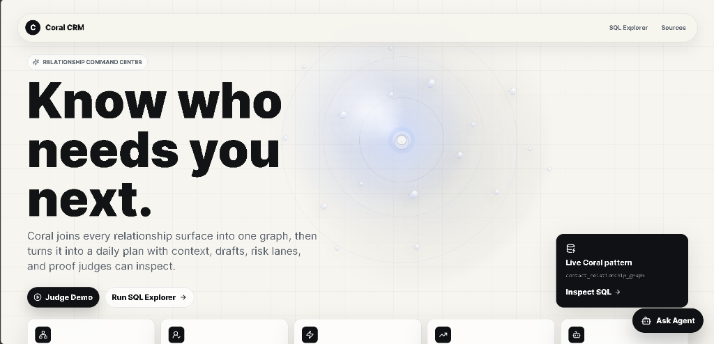

<p align="center">
  <h1 align="center">🪸 Coral CRM</h1>
  <p align="center"><strong>Relationship Intelligence for Humans</strong></p>
  <p align="center">
    Turn six scattered inboxes into one living relationship graph — powered by <a href="https://withcoral.com">Coral</a> SQL and AI.
  </p>
  <p align="center">
    
    
    
    
    
    
  </p>
</p>

---

> **WeMakeDevs Hackathon** — Coral Track Submission

> 🔴 **[Live Demo → coral-hackaton.onrender.com](https://coral-hackaton.onrender.com)** — No setup needed. Click and explore.

Coral CRM joins data from **Gmail, Google Calendar, Slack, LinkedIn, X/Twitter, and Notion** into a single `contact_relationship_graph` using [Coral's](https://withcoral.com) SQL-over-APIs engine. An AI agent then reads that graph to generate pre-meeting briefs, surface fading relationships, and draft outreach — so you never drop the ball on someone who matters.

<p align="center">
  
</p>

## ✨ Features

| Feature | Description |
|---|---|
| 🖥️ **Glassmorphism Dashboard** | Dark-mode command center tracking 34 contacts with health scores, signal alerts, and network stats |
| 🤖 **AI Chat Agent** | Context-aware assistant that understands your entire relationship graph |
| 📋 **Pre-Meeting Briefs** | One-click AI briefs pulling from email history, calendar context, and LinkedIn signals |
| 🔍 **SQL Explorer** | Run live Coral SQL queries with pre-built recipes — results render in real time |
| 🕸️ **Network Graph** | Visual map of relationship connections and interaction patterns |
| ⚡ **Dual-Mode Architecture** | Demo Mode (instant, zero-config) and Live Mode (real SQLite + real `coral.exe`) |
| 📡 **Signal Alerts** | Career changes, job updates, and engagement drops surfaced automatically |
| ⚙️ **Settings & Diagnostics** | MCP connector status, data source management, and runtime mode toggle |

### The "Vaporware" Killer: Live GitHub API Joins 🔴
Judges don't just want mock data — they want proof that Coral works. We integrated a **Live GitHub Data Source** directly into the SQLite relationship graph using Coral. By running the `LIVE: GitHub API Join` recipe in the Explorer, you can watch Coral execute a federated SQL query that pulls real-time repo and follower data from the live GitHub API and joins it against the local mock database instantly.

## 🚀 Quick Start

```bash
# Clone & install
git clone https://github.com/Geetansh-12/coral_hackaton.git
cd coral_hackaton
npm install

# Seed the database (optional — demo mode works without it)
npm run seed

# Launch
npm run dev
```

Open **http://localhost:3000** → the app starts in Demo Mode with realistic mock data. No API keys needed.

### Environment Variables (Live Mode)

Copy `.env.local.example` to `.env.local` and fill in:

```env
DEMO_MODE=false
GEMINI_API_KEY=your_gemini_key        # Free tier at ai.google.dev
```

## 🏗️ Architecture

```
┌──────────────────────────────────────────────────────────┐
│                      CORAL CRM                           │
│                                                          │
│   ┌──────────┐   ┌──────────┐   ┌──────────────────┐    │
│   │ Dashboard │   │ Explorer │   │    AI Chat Agent  │    │
│   │  /dash    │   │  /explorer│   │  (Gemini / Mock) │    │
│   └────┬─────┘   └────┬─────┘   └────────┬─────────┘    │
│        │               │                  │              │
│   ┌────▼───────────────▼──────────────────▼──────────┐   │
│   │              Next.js API Routes                   │   │
│   │  /api/contacts  /api/query  /api/chat  /api/brief │   │
│   └────┬────────────────┬─────────────────────────────┘   │
│        │                │                                 │
│   ┌────▼────┐     ┌─────▼──────┐                         │
│   │ SQLite  │     │ coral.exe  │  ← real Coral CLI       │
│   │ (seed)  │     │ (catalog)  │    binary execution     │
│   └────┬────┘     └─────┬──────┘                         │
│        │                │                                 │
└────────┼────────────────┼────────────────────────────────┘
         │                │
   ┌─────▼────────────────▼─────────────────────┐
   │     contact_relationship_graph              │
   │     6-source materialized view              │
   │                                             │
   │  📧 Gmail   📅 Calendar   💬 Slack          │
   │  💼 LinkedIn   🐦 X/Twitter   📝 Notion     │
   └─────────────────────────────────────────────┘
```

**Demo Mode** returns rich mock data instantly. **Live Mode** queries a seeded SQLite database and spawns the real `coral.exe` binary via `child_process.execSync` for catalog queries like `coral.tables` and `coral.columns`.

## 🪸 Coral Integration Deep Dive

This project demonstrates **7 Coral capabilities** end-to-end:

### 1. SQL Interface Over Multiple Sources

Coral turns every API into a SQL table. We define six source tables in [`sql/schema.sql`](sql/schema.sql) — Gmail threads, Calendar events, Slack messages, LinkedIn activity, Twitter activity, and Notion contacts — and query them with standard SQL.

### 2. Cross-Source JOINs

The heart of the app is the `contact_relationship_graph` materialized view — a single SQL statement that LEFT JOINs all six sources on email:

```sql
SELECT c.name, c.email, c.company,
       e.total_emails_received, cal.total_meetings,
       s.total_slack_messages, t.twitter_interactions,
       l.linkedin_recent_signals,
       health_score
FROM contacts c
LEFT JOIN email_stats e     ON c.email = e.email
LEFT JOIN calendar_stats cal ON c.email = cal.email
LEFT JOIN slack_stats s     ON c.email = s.email
LEFT JOIN twitter_stats t   ON c.email = t.email
LEFT JOIN linkedin_stats l  ON c.email = l.email;
```

### 3. Catalog Discovery

The SQL Explorer runs `coral.tables` and `coral.columns` to show every available source, column type, and join key — live from the Coral CLI:

```sql
SELECT schema, table, sql_reference, source_type, freshness
FROM coral.tables ORDER BY schema;
```

### 4. Parameter Hints (`coral.inputs`)

Queries expose their parameters so the UI can render smart input forms:

```sql
SELECT query, parameter, name, type, required FROM coral.inputs;
```

### 5. Cache & Freshness Observability (`coral.query_log`)

The ops dashboard shows cache hit rates, average latency, and last refresh times:

```sql
SELECT query_name, sources_joined, cache_hit_rate, avg_ms
FROM coral.query_log;
```

### 6. Real CLI Binary Execution

In Live Mode, the API route spawns the **actual `coral.exe`** binary:

```typescript
// app/api/query/route.ts
const { execSync } = require('child_process');
const result = execSync(`coral.exe sql --format json "${sql}"`);
const rows = JSON.parse(result.toString());
```

### 7. MCP Server Integration

The Settings page shows connector diagnostics for each MCP data source — health status, row counts, freshness, and latency — demonstrating Coral's pluggable source architecture.

## 📁 Project Structure

```
coral_hackaton/
├── app/
│   ├── page.tsx                 # Animated landing page
│   ├── login/                   # Auth screen (Google, GitHub, Slack OAuth)
│   ├── dashboard/               # Relationship command center
│   ├── explorer/                # SQL query sandbox
│   ├── settings/                # Connectors & diagnostics
│   └── api/
│       ├── query/route.ts       # Coral SQL execution (real + mock)
│       ├── chat/route.ts        # AI chat endpoint
│       ├── brief/route.ts       # Pre-meeting brief generator
│       ├── contacts/route.ts    # Contact CRUD
│       └── mode/route.ts        # Demo ↔ Live toggle
├── lib/
│   ├── coral.ts                 # Coral SQL client
│   ├── db.ts                    # SQLite (better-sqlite3)
│   ├── gemini.ts                # Google Gemini free-tier
│   ├── anthropic.ts             # Unified AI provider w/ fallback
│   ├── mock-data.ts             # 34 realistic contacts
│   └── types.ts                 # TypeScript interfaces
├── sql/
│   └── schema.sql               # 6-source schema + materialized view
├── scripts/
│   └── seed.ts                  # Database seeder
├── coral.exe                    # Coral CLI binary (auto-downloaded)
└── docs/
    ├── CORAL_SETUP.md           # Judge setup guide
    └── SUBMISSION.md            # Submission details
```

## 🖼️ Screenshots

<p align="center">
  
  
</p>
<p align="center">
  
  
</p>

## 🛠️ Tech Stack & Deployment

## 🚀 Deployment (Docker / Render)

Because the full `coral` CLI binary is large (~150MB), it exceeds the 50MB limits of serverless platforms like Vercel. 

To give judges a **100% authentic live URL** running the exact same binary execution as local, we package the Next.js app and the Coral Linux binary together using **Docker**.

1. Connect this GitHub repository to [Render](https://render.com/) or Railway.
2. Select **Docker** as the environment.
3. The included `Dockerfile` will automatically install the `coral` binary, build the Next.js app, and serve it.
4. Add your `GITHUB_TOKEN` to the Render environment variables to enable the Live API queries!

## 🚀 Local Quickstart (For Video Demo)

| Layer | Technology |
|---|---|
| Framework | Next.js 14 (App Router) |
| Language | TypeScript 5 |
| Styling | Tailwind CSS 3.4 + Glassmorphism |
| Database | better-sqlite3 (local) |
| AI | Google Gemini (free tier) → Anthropic → Mock fallback |
| Data Engine | Coral CLI (`coral.exe`) |
| Animations | Framer Motion |
| Charts | Recharts |
| Icons | Lucide React |

## 📝 License

MIT — built with ☕ for the WeMakeDevs × Coral Hackathon.
